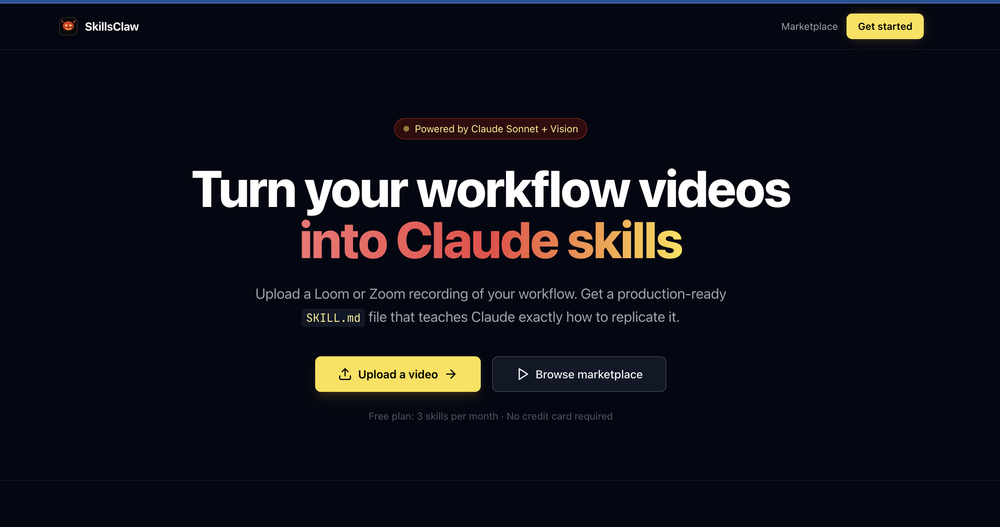

# SkillsClaw

<p align="center">
	<strong>Open-source workflow-to-skill platform</strong><br/>
	Turn Loom/Zoom recordings or SOP docs into production-ready Claude Code SKILL.md artifacts.
</p>

<p align="center">
	<a href="LICENSE"></a>
	<a href=".github/workflows/ci.yml"></a>
	
	
	
	
</p>

## Platform Screenshot



## Why SkillsClaw

SkillsClaw helps teams capture repeatable workflows from screen recordings and convert them into reusable Claude skills.

- Video or SOP in, skill package out
- Multi-provider LLM support (Anthropic, OpenAI, Gemini, OpenRouter, Ollama)
- Human review loop before publishing
- Multiple delivery paths: ZIP, GitHub publish, snippet, marketplace
- Open-source, self-hostable, contributor-friendly

## Table of Contents

- [Features](#features)
- [How It Works](#how-it-works)
- [Architecture](#architecture)
- [Quick Start](#quick-start)
- [Configuration](#configuration)
- [API Overview](#api-overview)
- [Roadmap](#roadmap)
- [Contributing](#contributing)
- [License](#license)

## Features

### Product

- Upload workflow videos and documents
- Live status updates during processing
- Skill review and editing UI
- Marketplace browsing and install flow

### AI Pipeline

- Transcription and text extraction
- Workflow step synthesis
- SKILL.md generation with trigger phrases
- Per-job provider/model selection

### Open-Source Ready

- Apache 2.0 license
- CI workflow and templates
- Contribution and code of conduct docs

## How It Works

1. Upload: Add a workflow video/audio file or SOP text/doc.
2. Analyze: Pipeline extracts workflow context and structure.
3. Synthesize: LLM generates reusable workflow steps.
4. Generate: System outputs a Claude-compatible SKILL.md.
5. Publish: Share via ZIP, GitHub, snippet, or marketplace.

## Architecture

```text
Frontend (React + Vite)
	|
FastAPI API
	|
Celery Worker + Redis Queue
	|
PostgreSQL + S3-compatible storage
	|
LLM Providers (Anthropic/OpenAI/Gemini/OpenRouter/Ollama)
```

Detailed architecture: [docs/architecture.md](docs/architecture.md)

## Quick Start

### Prerequisites

- Docker + Docker Compose
- Node.js 20+
- Python 3.11+
- At least one configured LLM provider

### 1) Clone and configure

```bash
git clone <repo-url>
cd skillsclaw
cp .env.example .env
```

Set your provider in .env, for example:

```bash
LLM_PROVIDER=ollama
OLLAMA_BASE_URL=http://localhost:11434
OLLAMA_TEXT_MODEL=qwen2.5:7b-instruct
```

or:

```bash
LLM_PROVIDER=anthropic
ANTHROPIC_API_KEY=sk-ant-...
```

### 2) Start local infra

```bash
docker compose up -d postgres redis minio
```

### 3) Run backend API

```bash
cd backend
python -m venv .venv
source .venv/bin/activate
pip install -r requirements.txt
alembic upgrade head
uvicorn app.main:app --reload
```

### 4) Run worker

```bash
cd backend
source .venv/bin/activate
celery -A app.pipeline.worker:celery_app worker --loglevel=info --concurrency=2
```

### 5) Run frontend

```bash
cd frontend
npm install
npm run dev
```

Open http://localhost:5173

## Configuration

### Auth Modes

- DEV_MODE=true: single local dev identity, auth checks bypassed
- DEV_MODE=false: normal auth flow (GitHub OAuth/JWT)

### Provider Matrix

| Provider | Env value | Required key |
| --- | --- | --- |
| Anthropic | anthropic | ANTHROPIC_API_KEY |
| OpenAI | openai | OPENAI_API_KEY |
| Gemini | gemini | GOOGLE_API_KEY |
| OpenRouter | openrouter | OPENROUTER_API_KEY |
| Ollama | ollama | none |

See .env.example for full configuration options.

## API Overview

Base URL: http://localhost:8000

- GET /health
- POST /api/upload/presign
- POST /api/upload/complete
- GET /api/jobs/{id}
- GET /api/jobs/{id}/status
- GET /api/skills
- GET /api/marketplace

Interactive API docs: http://localhost:8000/docs

## Roadmap

- Security hardening and rate limiting
- Expanded automated test coverage
- Release automation and versioned docs
- More provider-specific optimization profiles

## Contributing

Contributions are welcome.

- Read [CONTRIBUTING.md](CONTRIBUTING.md)
- Follow [CODE_OF_CONDUCT.md](CODE_OF_CONDUCT.md)
- Open issues and PRs with reproducible context

## License

Licensed under Apache 2.0. See [LICENSE](LICENSE).
